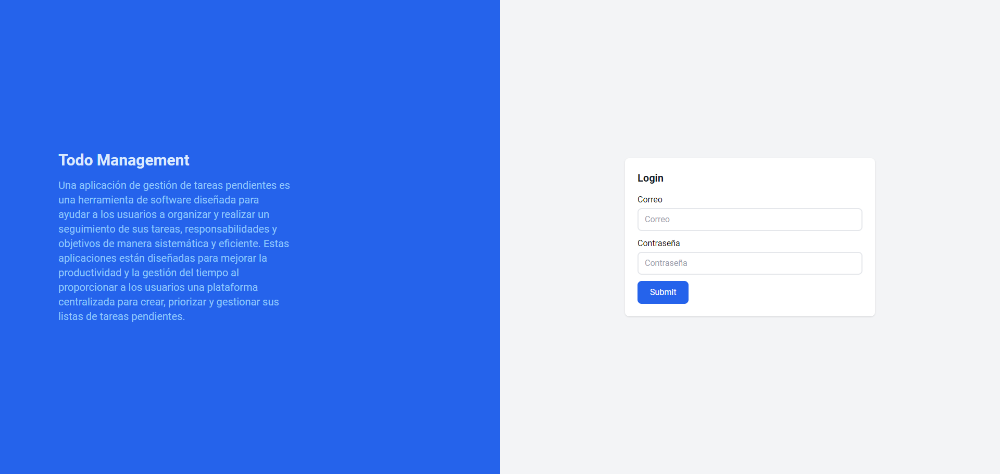
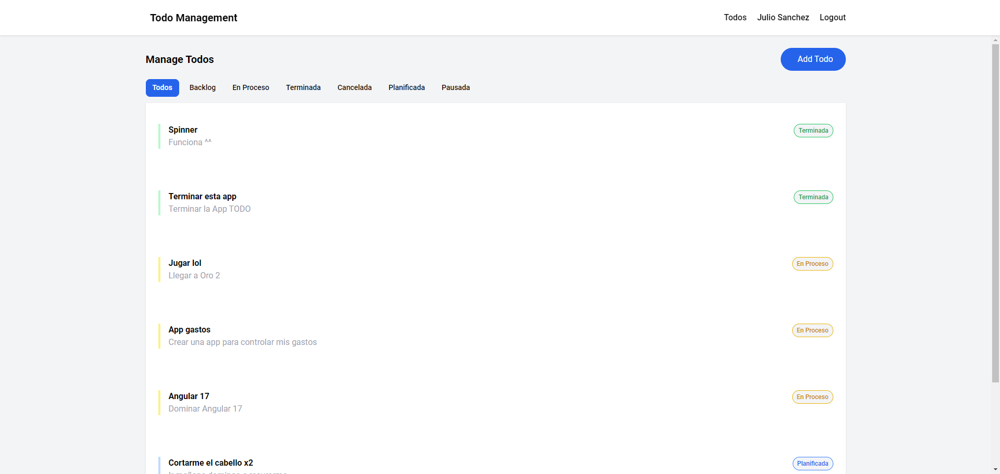
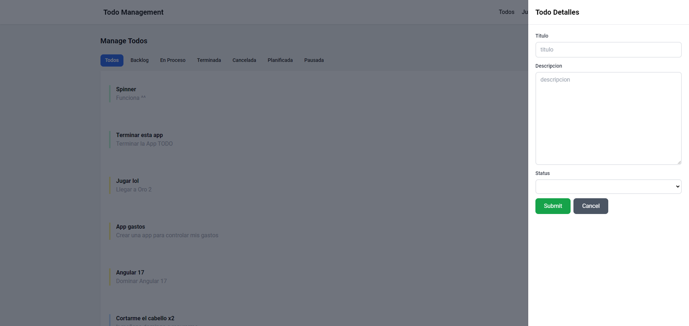
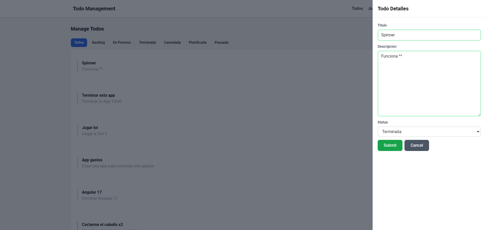
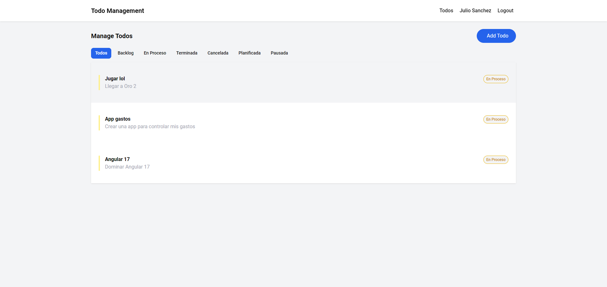

## Descripción

TodoManagement es una aplicación simple de gestión de tareas desarrollada con Angular 17. Utiliza Tailwind CSS para el diseño web y tiene un backend construido en .NET con SQL Server como base de datos.

## Tecnologías Utilizadas

- **Angular 17:** El frontend de la aplicación está desarrollado en Angular, un framework de desarrollo web.
- **Tailwind CSS:** Se utiliza para el diseño y la estilización de la interfaz de usuario, proporcionando un estilo moderno y responsivo.
- **.NET [Ir al Backend](https://github.com/JulioSancheZS/TodoManagementAPI):**  El backend de la aplicación está construido en .NET, que maneja la lógica del servidor.
- **SQL Server:** La información de las tareas se almacena en una base de datos SQL Server.

## Experiencia y Aprendizaje

Esta aplicación, TodoManagement, ha sido fundamental para mi comprensión de las bases de Angular 17. A través de su desarrollo, he adquirido conocimientos prácticos sobre la estructura de un proyecto Angular 17, la creación de componentes, la gestión de servicios, y la interacción con un backend construido en .NET.

Además, la integración de Tailwind CSS ha proporcionado una experiencia valiosa en el diseño y estilización de la interfaz de usuario, mejorando mi comprensión de cómo trabajar con estilos de manera eficiente en el entorno de desarrollo Angular.

### Login

### Get Todo

### Post Todo

### Put Todo

### Filter Todo
